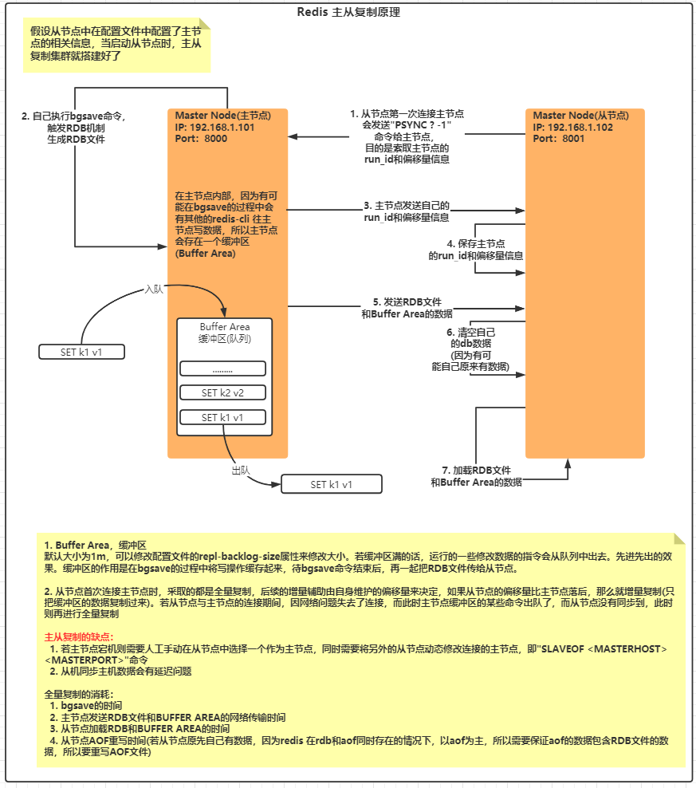
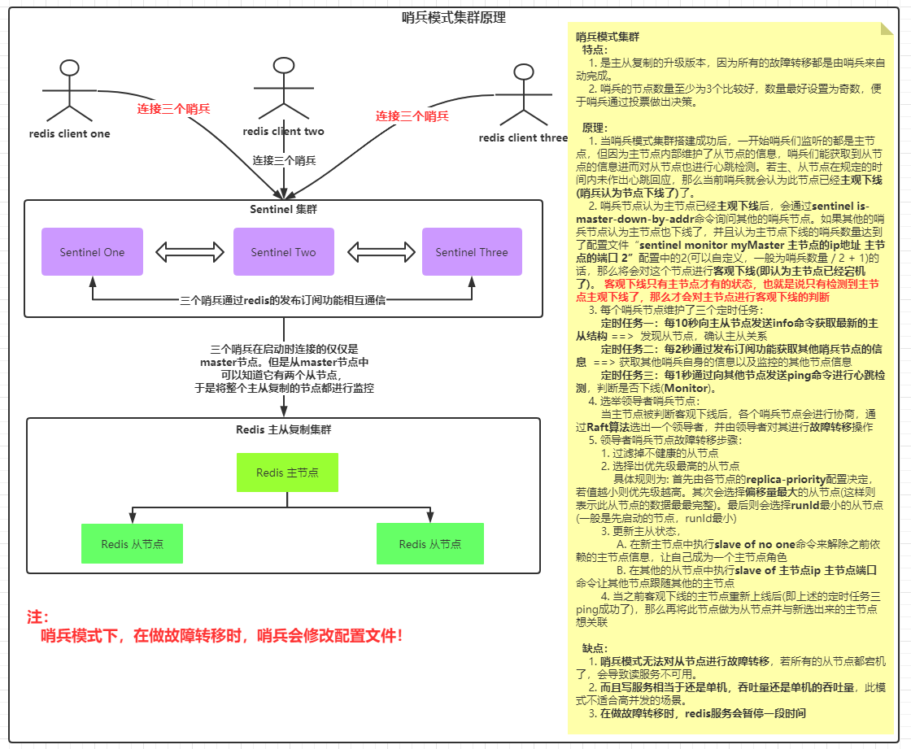
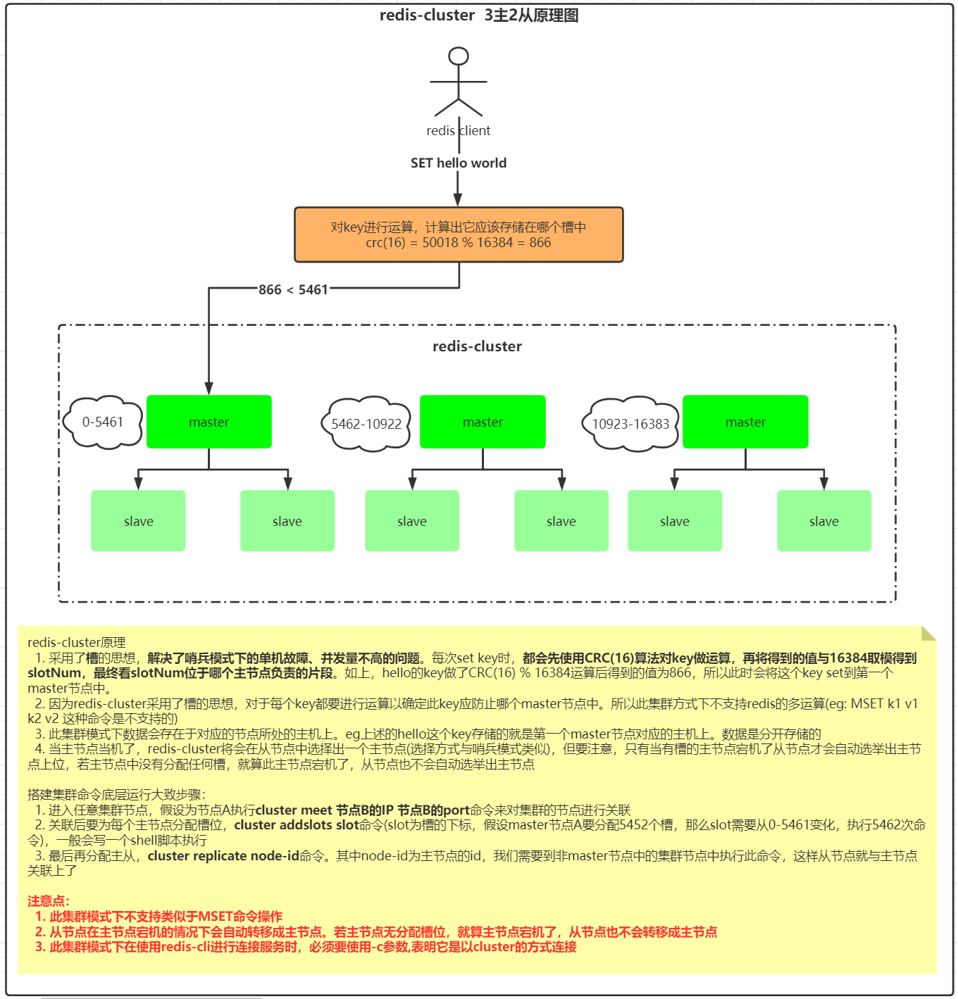

# Redis

## 一、缓存穿透
* 按照我们传统的缓存逻辑，第一次查缓存，缓存不存在则查db。db返回后再同步至缓存。
  这样就会出现缓存穿透的问题，假设用户或者网站攻击者传了一个db和缓存中都不存在的key，此时就会
  缓存和db一块查。最终还是以`无记录`返回。这样的结果就是缓存毫无作用。缓存的qps还
  是稳稳的比db高。若请求量大时，db肯定会先挂。
  
* 解决方案

  |        解决方案        |                          存在的问题                          | 备注 |
  | :--------------------: | :----------------------------------------------------------: | :--: |
  | 缓存空对象 +  超时时间 | 若攻击者使用脚本，循环使用不存在的key进行请求，此时还是每个key都要走一下db |  无  |
  |     使用布隆过滤器     | 具有容错率，有可能会将不存在的key误认为存在，解决此问题也蛮ok |      |

  **布隆过滤器**:

    ```txt
  布隆过滤器是一个很长的二进制向量和一些列随机映射函数。它可以检索一个元素是否在一个集合中。优点是空间效率和查询时间远远超过了一般的算法，缺点是存在误判率。
  要想了解这句话，先看下图:
    ```

  

  大致的意思就是: 在一个二进制向量中，我们把一些数据放入至布隆过滤器中。在放入的过程中，每个key会执行N个hash函数，然后将hash之后返回的值对应的槽位上标志为1(eg: hash后的值为10，则在第十个槽上表示为1)。这样，一个key可能在二进制向量中有N个标识。所以当我们要校验，一个key是否在布隆过滤器中时，我们可以把key按照同样的逻辑，进行N个hash，然后校验下N个hash后的值对应的槽是否为1，如果都为1，我们则认为它`可能存在`。如果存在有0，那么它一定不存在。这里说明下，为什么都为1的情况下只是可能存在。`因为hash具有概率性，也就是说不同的key执行hash后有可能返回的值是一样的，这样就发生了hash碰撞。所以二进制向量中某个位置为1，有可能是多个key都会使用上它`

## 二、缓存雪崩

* **同一时间的大面积key失效，导致所有请求都请求到了db**。这时数据库挂了，整个应用肯定都没法工作了呀。
  临时应急方案可以对方法做降级处理，不让它走这个方法

* 当然，我们要从根源解决问题:

  ```txt
  因为雪崩是一些常用的key在某个时间段同时失效，导致请求绕过缓存打向DB。
  所以我们可以为所有的key都随机添加一个失效时间，这样的话，每个key对应
  的失效时间都不同，就不会导致这个问题啦
  setRedis（Key，value，time + Math.random() * 10000）；
  设计随机的过期时间可能也会出现雪崩的场景，这也是有概率发生的。
  最好的就是可以将热点key设置成永远不过期，运维可以选择在用户使用少的情况下，
  在后台对某些业务逻辑做操作, 来触发更新缓存的操作
  ```

## 三、缓存击穿

* 缓存击穿和缓存雪崩类似，但又有点不同。缓存雪崩是大面积key失效而把请求打入db。而缓存击穿是因为某一个key失效. 

* 解决方案:

  ```txt
  方案1: 缓存击穿和可以和雪崩一样设置key永远不过期
  方案2: 加多级缓存，防止打入db
  方案3: 使用一个定时任务，类似于redisson的看门狗，假设key的过期时间是30分钟后，那么我在29分钟时就去续命，同时针对这个看门狗，可以定义一个开关，我们可以使用api来动态打开/关闭它
  ```
  
  

## 四、分布式锁

* 使用策略者设计模式体现了分布式锁的一步步优化。

* 使用redis作为分布式锁的基础: `setnx (set if not exist)`，它是一个原子性操作加上redis单线程的特性。一次只能有一个人能set成功

  * 第一种：使用**setnx** + **exist** + **del**指令   ===>   `exist + del 两个操作非原子性`

    ```markdown
    大致的流程为: 
      先setnx，若返回1(setnx命令返回的是1)则表示加锁成功。然后去处理正常逻辑，处理完成后则校验key(exist指令)是否存在，若存在则解锁(del指令)。
      
    按照上面的正常逻辑好像没有一点问题，但是我们细分一下:
    setnx是保证了互斥性，保证只有一个人能set成功(获取到锁) --> 这没有问题
    
    exist + del 判断key存在则删除 ---> `这里有问题！`
    为什么呢？首先exist和del是两个指令，对于redis单线程而言，完全有可能在exist和del指令执行之间执行其他指令。可能你会说，没关系呀，反正我就是要删除他，就算中间穿插的命令为增删改，我最后还是可以删除呀。当然，这无可厚非，**但是如果此时中间执行的操作是把其他锁给删掉了呢？那不是会乱套？或者说在中间准备执行del指令时，应用程序挂了，那这把锁不就变成死锁了嘛** 所以我们要保证，exist + del作为原子性的操作来执行。对于redis而言，没有一个命令具备这样的功能，所以此时我们可以使用lua脚本来保证他们的原子性操作;
    
    所以这样就引出了下面第二种的实现方式
    ```

  * 第二种: 使用**setnx** + **lua脚本删除锁**   ====>  `解锁步骤依赖于代码，可能造成死锁`

    ```markdown
    此种方式与第一种相比, 唯一的不同就是在删除锁的那一步，在此种方式中保证了`exist + del`操作的原子性。好像，这么一整套下来没什么问题。但，仔细一想，锁的删除是依赖与一段代码来执行的。**假设，在获取锁并执行业务逻辑的过程中，项目抛运行时异常了或者直接挂了...**`没错，它又变成死锁了，这把锁永远不会被释放了`。于是，针对此种情况，出现了如下第三种设计方案
    ```

  * 第三种: 使用**setnx** + **expire** + **lua脚本删除锁**  ====>  `setnx + expire操作非原子性`

    ```markdown
    此种方式在第二种的基础上，完善了加锁流程，即我加完锁后给锁设置一个过期时间，这样就算应用程序挂了、业务逻辑抛异常等等任何原因导致不会执行lua脚本释放锁的代码。都能保证不会造成死锁。 但是，这又出现了第一种的问题了, 两个操作不是原子性操作。可能聪明的你又会说，可以使用lua脚本呀。不巧的是，redis支持`setnx + expire`原子性操作的指令。于是引出了下面第四种版本。
    ```

  * 第四种: 使用**set key value nx ex seconds** + **lua脚本删除锁**

    ```markdown
    使用此种方式好像已经无懈可击了。就算程序挂了，我有自动过期时间，完全不怕死锁。好像的确已经无懈可击了。哦，不对。你的锁有过期时间，`假设我们的业务逻辑消耗时间比过期时间还长怎么办？此时我们的业务还在执行，但是锁已经没有了（过期失效了），其他的请求又可以拿到锁进行业务逻辑了。此时锁不就失去了它的互斥性了嘛？并且锁的key都是一样的，所以在这种情况下前一个拿到锁的实例还会执行删除锁的逻辑，此时完全有可能删除其他实例获取的锁`。
    或者，假设我们的锁添加了重试次数（即若当前申请获取锁失败了，则会有重试次数的设置，设置重试次数为5次，当重试5次后还没有获取锁的话，就会执行finally的代码，一般我们都是在finally中执行的释放锁，因此也会出现我自己删除了别人的加的锁的情况）
    于是，引出了下面的最终版本:
    ```

  * 最终版本: 使用**set key value nx ex seconds** + **lua脚本删除锁** + **随机value**

    ```
    在添加key时，我们可以添加一个唯一的value(eg: uuid). 我们可以根据这个value来决定能不能删除这个锁，因为我set锁的时候我能知道set进去的value是怎样的，最后再确认下key对应的value是不是我set的value，如果是则允许删除。否则则删除不了，这样就避免了其他人删除了我的锁的情况
    ```

* **综上所述，redis实现分布式锁会存在`死锁`，`非原子性`，`防止他人删除自己锁`的问题，对应的解决策略就是`设置过期时间`, `使用lua脚本或redis中自带的原子性命令`, `添加唯一value，根据value删除锁`**

* **具体参考[传送门](https://github.com/AvengerEug/redis-study/tree/develop/redis-basic/src/main/java/com/eugene/sumarry/redis/distributedlock)**

* **同时记录下在使用redis实现分布式锁遇到的问题**:

  ```java
  1. 遇到的第一个问题: 使用多线程操作同一个jedis对象，报了很多奇怪的错:
   *   redis.clients.jedis.exceptions.JedisConnectionException: Unexpected end of stream.
   *   ERR Protocol error: invalid multibulk length
   *   read time out
   *   最终解决方案是每一个线程操作redis时，都从redisPool中去获取jedis对象。
   *   并使用ThreadLocal的特性保证每个jedis都是从redisPool中去获取jedis对象。
  2. 需要设置JedisPool的配置设置最大等待时间，因为锁会自旋，所以会出现一些超时的情况:
     具体配置如下:
       static {
           // 最大链接，-1表示无限制
           jedisPoolConfig.setMaxTotal(-1);
           // 最大等待时间, -1表示无限制
           jedisPoolConfig.setMaxWaitMillis(-1);
       }
  
       private static final JedisPool jedisPool = new JedisPool(jedisPoolConfig,"127.0.0.1", 6379);
  
  ```

* 但使用上述的最终版本还是会问题，就是锁的超时时间的判断，我们不好来定义这个过期时间，因为有可能会太长也有可能会太短。所以此时我们需要一个`timer`。`timer`的作用就是一个定时器，在加锁的时候开一个子线程，设置一个时间点，当过了多少时间就延长下过期时间。这个功能已经被`redisson`框架实现了，默认是每隔`1/3`的时间就延长一下锁，当这把锁删除了，也就是持有锁的线程释放锁了，此时timer也可以结束工作了。所以此时可以使用`redisson`实现分布式锁

* **什么时候要使用分布式锁？**

  ```txt
  1、存在锁资源竞争
  2、不允许多个线程同时操作同一个东西，比如一个交易状态的更新，在待支付状态，同时有两个请求同时处理，一个是取消支付，
    另外一个是支付完成，此时应该要把这个订单给锁住，保证在一个时间点下只能有一个线程来更新这笔交易状态
  ```

  

## 五、RDB机制

* Redis是基于内存的，一般存在内存的数据，我们把应用关闭后，数据就不见了，而redis能做到持久化的原因是因为
  **它将持久化的数据转成RDB(内容是二进制)文件存在硬盘上了**。当redis内部执行**shutdown**命令或者执行**save/bgsave**
  命令时就会将RDB里面的数据重新加载到内存中了。
  那么我们是如何保证RDB里面的数据是最新的呢？这就跟触发RDB机制有关了，
  我们可以手动执行`save(阻塞)/bgsave(非阻塞)`命令、也可以在配置文件中配置相关内容，比如说redis的默认配置:
  save 900 1  // 900s 内有一个数据进行更改，则触发RDB机制
  save 300 10  // 300s内 有10个数据进行更改，则触发RDB机制
  save 60 10000 // 60s内有10000个数据进行了更改，则触发RDB机制
  当满足上述条件后，redis的rdb操作将被触发。
  此时redis会fork出一个子进程，专门来做数据持久化，将数据首先写进一个临时文件中(文件名: **temp-当前redis进程ID.rdb**)，
  后续再把数据写入RDB文件。因为redis是单线程的，所以fork出的子进程并不会干扰主进程的操作，相当于是异步持久化。
  这样就达到了redis数据持久化的功能。

  ps：若想让redis引用其他的rdb文件，需要修改配置，并且将rdb文件与启动redis的目录一致。

* 缺点：`会失去某一个时间段的数据`，假设配置的是300S内有10个数据进行了更改则触发RDB机制的话，我在第9个更新数据的操作时，redis停电了。此时前面的8个更新操作的记录就么有了。

## 六、AOF机制

* 什么是AOF机制？
  在使用redis的RDB机制时可能会出现这样一种场景，当应用在进行写操作时，并没有达到RDB的默认触发机制(eg: save 900 1)以及没有手动调用save/bgsave命令。此时若停电了！那么在上一次同步RDB到未触发RDB机制的过程中对数据的修改将会丢失。所以此时要利用redis中的AOF机制来处理。redis的AOF机制，它可以将对数据的增删改操作记录在一个文件中，当出现上述断电的情况时，我们可以使用AOF机制，将记录过的命令重新再运行一遍，这样数据就恢复了！

* 如何开启AOF机制？
  配置文件中配置: **appendonly为yes**，默认的aof文件名为: appendonly.aof

* 如何触发AOF机制?
  配置文件中分别有如下三种:
  appendfsync always   --> 每次发生增删改操作时，就把命令记录到aof文件，会影响redis性能，但是安全 
  appendfsync everysec --> 每秒记录一次，比较安全，但有可能会丢失1s以内的数据
  appendfsync no  --> 由操作系统来决定什么时候进行记录，无法保证是否做了持久化
  **所以，一般使用的是appendfsync everysec的配置来进行aof触发机制**

* 如何运行的？
  若按照appendfsync everysec的配置进行aof触发机制的话，当执行增删改操作时，会在配置文件中的dir配置的路径下生成一个appendonly.aof文件，里面保存的一些redis识别的内容。

* 注意事项: **若AOF机制开启了，那么redis在重启的时候，将会从aof文件中加载，rdb文件将无用**
  所以若AOF和RDB机制同时存在且有appendonly.aof文件，那么redis将不会读取RDB文件。
  若appendonly.aof文件文件不存在，则会读取RDB中的文件

## 七、RDB、AOF混合持久化

* 根据各自的特点来决定:
  RDB是做持久化的，虽然会fork一个子进程来做持久化操作，但是会影响到redis服务器的性能，当redis负载量非常大的时候，这难免也是一个影响性能的操作。而且它只能备份某个时间点的数据，若在备份过程中有一些额外的原因导致系统故障，则未备份的部署数据可能会丢失，如果比较倾向于实时性的持久化操作，不建议用RDB。RDB比较适合灾难恢复，可以采用异地容灾的操作，这样至少能保证一大部分的数据

  AOF是将所有的增删改命令以追加的方式写在aof文件中，通过redis的配置来决定aof同步的频率。当aof机制打开时，redis在重启时加载的是aof文件。aof还能支持重写瘦身，会分析命令，比如记录了set a 1; set b 2这两条命令，当使用文件重写瘦身后，aof文件只会存储set a 1 b 2这一个指令.

  但是一般是这两种机制都加上，基本上在硬盘不坏掉的情况下，数据基本不会丢失，最好再开启redis的混合持久化功能，将RDB文件的内容也加载到AOF文件中，这样就能保证在AOF存在的情况下RDB会失效的情形。

## 八、redis集群

### 8.1 主从复制

* 主提供写服务，从提供读服务 `一主多从`

* 搭建步骤

  ```txt
  # 搭建redis集群的核心就是玩配置文件
  1. 新建三个文件夹
     eg: 
     /usr/local/redis-master-slave/redis8000
     /usr/local/redis-master-slave/redis8001
     /usr/local/redis-master-slave/redis8002
  2. 将redis.conf配置文件复制到redis8000文件夹下
  3. 修改redis8000文件夹下的redis.conf文件的如下内容:
      1. bind 0.0.0.0
      2. port 8000
      3. daemonize yes
      4. pidfile /usr/local/redis-master-slave/redis8000.pid  
      5. dir /usr/local/redis-master-slave/redis8000
      6. requirepass 123456
  4. 将redis8000文件夹下的redis.conf文件分别复制到redis8001、redis8002文件夹下
  5. 修改redis8001文件夹下的redis.conf文件
     1. 将内部所有的8000改成8001  ==> :%s/8000/8001/g    批量替换
     2. 修改replicaof配置为: replicaof 主机的ip 主机的端口
     3. 修改masterauth配置为: masterauth 123456    ===> 这里要和主机的密码一致
  6. 修改redis8002文件夹下的redis.conf文件
     1. 将内部所有的8000改成8002  ==> :%s/8000/8002/g    批量替换
     2. 修改replicaof配置为: replicaof 主机的ip 主机的端口
     3. 修改masterauth配置为: masterauth 123456    ===> 这里要和主机的密码一致
  7. 分别启动三个redis服务
     redis-server /usr/local/redis-master-slave/redis8000/redis.conf
     redis-server /usr/local/redis-master-slave/redis8001/redis.conf
     redis-server /usr/local/redis-master-slave/redis8002/redis.conf
  8. 连接到对应的redis服务，使用 "info server"和"info replication"命令查看服务信息以及集群信息
  9. 至此，redis主从复制集群搭建完成
  
  其他相关:
    1. 动态临时扩容slave节点
       方式一: 临时的(节点重启就没了)
         1. 在启动redis服务后执行"SLAVEOF <masterip> <masterport>"命令
         2. CONFIG SET masterauth 123456 ===> 要保证和主节点密码一样
       方式二: 持久性的
         1. 跟上述第5步类似，修改配置文件
  ```

* 原理

  
  
* 主从模式官方说明链接：[http://www.redis.cn/topics/replication.html](http://www.redis.cn/topics/replication.html)

### 8.2 哨兵模式

* 主从复制的升级版(但还是`一主多从`)，当master挂了后，不需要手动指定master，而是由哨兵自己从slave节点中选出一个master，并将其他的slave节点与master节点关联起来

* 搭建步骤

  ```shell
  1. 基于上述 5.1主从复制 的步骤，修改redis8000文件夹下的redis.conf文件，修改masterauth属性为: masterauth 123456  ==> 原因: 因为在哨兵模式下，主有可能变从，从有可能变主，而在做主从集群时，从节点需要配置主节点认证的密码。
  2. 分别创建三个文件夹
     eg:
     /usr/local/redis-sentinel/sentinel28000
     /usr/local/redis-sentinel/sentinel28001
     /usr/local/redis-sentinel/sentinel28002
  3. 在redis安装目录中将sentinel.conf文件copy到sentinel28000文件夹内，并修改sentinel.conf文件如下配置
     1. port 28000
     2. daemonize yes
     3. logfile "/usr/local/redis-sentinel/sentinel28000/sentinel.log"
     4. sentinel monitor myMaster 127.0.0.1 28000 2 # 这句话的意思是: 当前哨兵监听一个叫myMaster名字，ip为127.0.0.1，端口为28000的主节点，最后面的2表示在三个哨兵中，若有2个哨兵认为这个主节点挂了，那么将进行故障转移，这个2一般为 （哨兵的数量 / 2 + 1）
  4. 将/usr/local/redis-sentinel/sentinel28000/sentinel.conf文件分别copy到sentinel28001文件夹内，并修改如下配置:
     1. 将内部所有的28000修改成28001 ==>  :%s/28000/28001/g
  5. 将/usr/local/redis-sentinel/sentinel28000/sentinel.conf文件分别copy到sentinel28002文件夹内，并修改如下配置:
     1. 将内部所有的28000修改成28001 ==>  :%s/28000/28002/g
  6. 分别启动三个redis服务和启动三个哨兵服务
     redis-server /usr/local/redis-master-slave/redis8000/redis.conf
     redis-server /usr/local/redis-master-slave/redis8001/redis.conf
     redis-server /usr/local/redis-master-slave/redis8002/redis.conf
  
     redis-sentinel /usr/local/redis-sentinel/sentinel28000/sentinel.conf
     redis-sentinel /usr/local/redis-sentinel/sentinel28001/sentinel.conf
     redis-sentinel /usr/local/redis-sentinel/sentinel28002/sentinel.conf
     
  7. 使用客户端连接哨兵，访问redis
  ```

* 哨兵模式原理图

  
  
* 哨兵模式官网说明链接: [http://www.redis.cn/topics/sentinel.html](http://www.redis.cn/topics/sentinel.html)

* 哨兵模式下的脑裂问题：

  ```txt
  所谓脑裂是指在集群环境下，本来只有一个master节点，但是因为master节点的网络问题，哨兵在进行心跳检测时，误认为它挂了，于是它会重新进行master的选举。最终选出一个master。但是此时原来master的网络恢复了，于是出现了两个master节点。这就是脑裂的情况。
  
  怎么解决呢？
  我们可以在redis中添加一些配置，指定一个master的最小从节点数，若master从节点数低于这个配置，则这个master节点会拒绝写操作。可以解决这个问题。
  ```

### 8.3 redis-cluster

* Redis高可用集群方式，比较受欢迎的一种集群方式

* 3主6从结构搭建步骤(为什么选择3主6从呢？因为想测试下--cluster-replicas参数的含义，此参数表示的是每个主节点携带的从节点个数) `PS: 如下步骤是将9个redis实例部署在同一台服务器上，若要拆分，可以使用3台服务器，每台服务器部署3个实例，同时要注意修改对应的配置文件`

  ```shell
  1. 新建9个文件夹分别为:
    mkdir -p  \
    /usr/local/redis-cluster/7000 \
    /usr/local/redis-cluster/7001 \
    /usr/local/redis-cluster/7002 \
    /usr/local/redis-cluster/7003 \
    /usr/local/redis-cluster/7004
    
    mkdir -p \
    /usr/local/redis-cluster/7005 \
    /usr/local/redis-cluster/7006 \
    /usr/local/redis-cluster/7007 \
    /usr/local/redis-cluster/7008
  2. 拷贝文件redis.conf文件至/usr/local/redis-cluster/7000中
  3. 修改redis.conf配置文件为如下内容：
     1. daemonize yes
     2. port 7000
     3. bind 192.168.111.153  # 当前机器的ip
     4. dir /usr/local/redis-cluster/7000
     5. cluster-enabled yes
     6. cluster-config-file nodes-7000.conf #当集群搭建成功后会在此文件中存储集群的相关信息
     7. cluster-node-timeout 5000 #配置节点连接超时时间
     8. appendonly yes  #启动aof机制
     9. appendfilename "appendonly-7000.aof"
     10. masterauth 123456
     11. requirepass 123456
  4. 使用命令生成7001-7008的文件夹中的redis.conf文件
     1. sed 's/7000/7001/g' /usr/local/redis-cluster/7000/redis.conf > /usr/local/redis-cluster/7001/redis.conf
     2. sed 's/7000/7002/g' /usr/local/redis-cluster/7000/redis.conf > /usr/local/redis-cluster/7002/redis.conf
     3. sed 's/7000/7003/g' /usr/local/redis-cluster/7000/redis.conf > /usr/local/redis-cluster/7003/redis.conf
     4. sed 's/7000/7004/g' /usr/local/redis-cluster/7000/redis.conf > /usr/local/redis-cluster/7004/redis.conf
     5. sed 's/7000/7005/g' /usr/local/redis-cluster/7000/redis.conf > /usr/local/redis-cluster/7005/redis.conf
     6. sed 's/7000/7006/g' /usr/local/redis-cluster/7000/redis.conf > /usr/local/redis-cluster/7006/redis.conf
     7. sed 's/7000/7007/g' /usr/local/redis-cluster/7000/redis.conf > /usr/local/redis-cluster/7007/redis.conf
     8. sed 's/7000/7008/g' /usr/local/redis-cluster/7000/redis.conf > /usr/local/redis-cluster/7008/redis.conf
  5. 分别启动上述9个redis实例
     redis-server /usr/local/redis-cluster/7000/redis.conf
     redis-server /usr/local/redis-cluster/7001/redis.conf
     redis-server /usr/local/redis-cluster/7002/redis.conf
     redis-server /usr/local/redis-cluster/7003/redis.conf
     redis-server /usr/local/redis-cluster/7004/redis.conf
     redis-server /usr/local/redis-cluster/7005/redis.conf
     redis-server /usr/local/redis-cluster/7006/redis.conf
     redis-server /usr/local/redis-cluster/7007/redis.conf
     redis-server /usr/local/redis-cluster/7008/redis.conf
  6. 执行集群命令
     redis-cli --cluster create 192.168.111.153:7000 192.168.111.153:7001 192.168.111.153:7002 192.168.111.153:7003 192.168.111.153:7004 192.168.111.153:7005 192.168.111.153:7006 192.168.111.153:7007 192.168.111.153:7008 --cluster-replicas 2 -a 123456
     ==> 按照一定的顺序，比如设置了--cluster-replicas的参数为2，则表示每个主节点有2个从节点，同时redis会计算命令中的节点个数，因为redis-cluster至少是需要3个主节点的。所以会将前面三个ip+port的组合当成主节点，然后去计算 3 * 2 = 6, 最后去验证后面是否有6个从节点，如果无则启动集群失败。
  7. 验证
     1. 登录
       redis-cli -c -h 192.168.111.153 -p 7001 -a 123456
     2. 设置值
       set k1 v1
     3. redis-cli -c -h 192.168.111.153 -p 7008 -a 123456
       get k1
     获取值成功则表示集群搭建成功
  8. 查看节点信息
     redis-cli -c -h 192.168.111.153 -p 7001 -a 123456 cluster nodes
     ===> 能看到当前在哪个节点上，也能看到每个节点分配的槽位、节点的id、节点的角色、从节点跟随哪个主节点等等
     
  注意点：
     集群搭建好后，会将集群信息写入上述配置的 cluster-config-file属性的文件内，就算redis服务重启后，redis还是能根据文件内的属性将集群重新还原，所以就算服务器宕机了或者停电了，也不需要重新维护集群关系，直接把每个redis实例启动即可。
  ```

* redis-cluster原理图

  

* redis-cluster官网说明链接：[http://www.redis.cn/topics/cluster-tutorial.html](http://www.redis.cn/topics/cluster-tutorial.html)

## 九、缓存一致性常见问题

* 常见的缓存一致性问题的解决方案一般有两种，分别是：**双写模式**和**失效模式**

* 双写模式：

  ```txt
  所谓双写模式指的是：
    当我们更新MySQL后，顺带把缓存的数据给更新了。在正常情况下，这也是能够实现的。如果缓存的内容比较简单，不需要通过复杂的计算得出，这也是可以的。但如果需要经过复杂的计算得出，这个时候我们更倾向于把缓存删除，体现懒加载的机制。
  ```

  使用双写模式在高并发情况下会出现问题：

  ```txt
  假设在高并发更新数据库的情况下，线程1比线程2先到达服务器，并且线程1和线程2都更新完了数据库，但是有可能线程1
  的机房与redis的机房离得比较远，导致在更新缓存的步骤中，线程2先更新完了缓存，然后线程1才更新。此时出现了线程
  时序错乱的问题
  ```

  解决方案：

  ```txt
  1、线程时序错乱问题，我们加锁能完美解决，但是加锁肯定会降低系统的QPS，如果对数据一致性要求没那么高，则不建
     议采用加锁的方式
  2、一般的缓存，我们都会添加过期时间，如果业务对数据一致性要求每那么高的话，可以采用最终一致性的方案来解决。
     比如给每个缓存的key设置过期时间，等过期时间一到，下一次的请求就会更新缓存
  ```

* 失效模式：

  ```txt
  所谓失效模式指的是：
    更新完MySQL后，直接把缓存删了。这体现了一种懒加载机制，这样就能保证每次获取到的数据都是DB最新的数据。
    但是这样也会有问题，比如线程一更新完了数据，删除了缓存，但是线程2更新完了数据后还没删除缓存，此时请求三来
    读取数据了，此时读取到的是线程一更新完的数据，也会出现缓存不一致的问题。
  ```

  解决方案：

  ```txt
  1、缓存的所有数据都设置过期时间，更新DB的同时把缓存删了。(设置过期时间主要是防止删除缓存的操作失败)
  2、在读写缓存之前添加分布式读写锁，读读情况下不会影响QPS，只有在写操作情况下，才会影响部分QPS
  ```

##  十、缓存一致性最终解决方案

* 因为无论是双写模式还是失效模式都会出现问题，所以我们在架构缓存一致性情况时，应该往如下方向去考虑：

  ```txt
  1、如果是并发几率非常小的数据，比如: 用户个人信息、权限数据等等，不需要考虑缓存一致性问题，给缓存添加过期时
     间，每隔一段时间主动更新即可
  2、并发几率非常高的数据，可以使用canal订阅MySQl binlog的方式(canal会监听MySQL binlog日志，如果有DB有更新
     数据，则会通知canal)
  3、如果业务允许缓存一致性没有那么高，则可以跟第一点一样，给缓存添加过期时间，过期后再主动更新
  4、如果缓存一致性要求非常高，我们可以添加分布式读写锁，保证写数据时的线程安全以及后面的读数据一定能拿到最新
     的写数据
  ```

* 总结：

  1、我们能放入缓存的数据本就不应该是实时性、一致性很高的。如果实时性、一致性很高，我们应该直接查询db。

  2、我们不应该过度设计，增加系统的复杂性

  3、所以缓存一致性，一般是添加过期时间，以最终一致性的方案来实现数据一致性

  4、如果db查询很慢，而且实时性很高(总结中的第一条无法满足)，此时可以使用**分布式读写锁 + 过期时间**来保证

  ​      一致性

## 十一、再述缓存穿透、雪崩、击穿

* 再次以一个比较全的视角来总结缓存穿透、雪崩、击穿。

* 所谓的缓存穿透、雪崩、击穿，其实都是因为我们引入缓存的原因。首先，我们引入缓存的目的是提高数据库的QPS，在正常情况下，MySQL的QPS的上限只有2000左右。在高并发情况下，我们不能同时将2000个请求同时落到MySQL中，此时，我们就可以引入缓存了。而引入缓存后，我们的查询过程都是先查询缓存，缓存不存在再查询数据库，最后再把数据库查询出来的值添加到缓存中。而所谓的缓存穿透、雪崩、击穿都是一种缓存失效的表现形式： 

  > 1、比如：我们请求一个不存在的key，这个时候缓存肯定没有命中，请求会打入数据库中，又因为这个key在数据库中也不存在，不需要写入缓存，导致后续所有不存在的key都会打入数据库中。假设此时对这个不存在的key有1w的并发进来，那数据库肯定会崩 ---> **这就是缓存穿透**。而缓存穿透的解决方案也比较简单，可以把不存在的key以null值添加到缓存中，并设置过期时间。这样就能有效的避免请求打入数据库了。
  >
  > 
  >
  > 2、再比如：首页的热点新闻、热卖商品都属于热点数据（访问量大，需要添加缓存），而这些热点数据的结果值在底层是有一个job统一经过比较复杂的计算得出，并放入缓存中。通常，我们的key都会设置一个过期时间。假设某个时间段这些key全部过期失效了，导致我们请求首页时，所有热点数据的计算都要重新计算一遍，当并发量大的情况下，所有的请求都会去数据库中找数据、计算，最终也将数据库打死。**这就是缓存雪崩**，而缓存雪崩的主要原因是因为key同一个时间点过期，导致缓存失效，进而请求到数据库的情况。解决方案有很多种，第一种：我们加锁，保证只有一个线程请求数据库、计算、并放入缓存中。这样，后续的所有请求都从缓存中获取了。第二种：设置key永远不过期，也是一种方案，但是不推荐。第三种：对每个key设计随机的过期时间。
  >
  > 
  >
  > 3、再比如：缓存**击穿**的话，与缓存雪崩类似，只不过它是针对于一个key的失效，通常这个key都是热点key。解决方案的话，可以参考缓存雪崩的解决方案。
  >
  > 